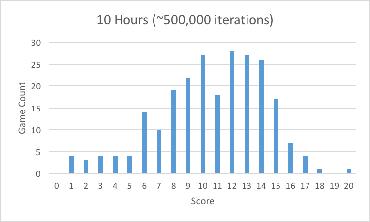
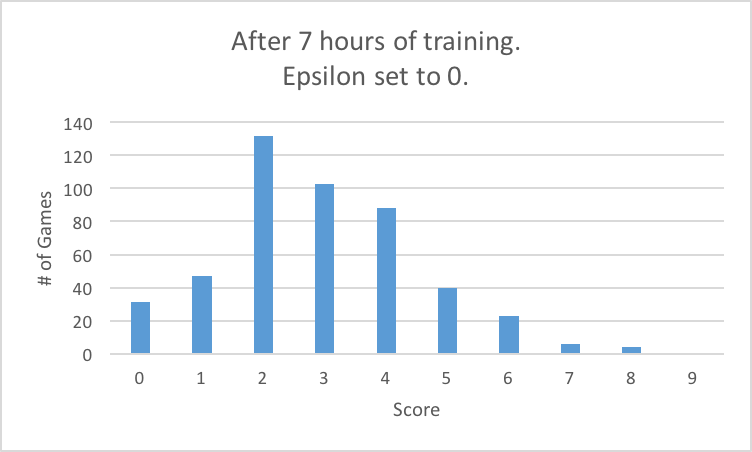
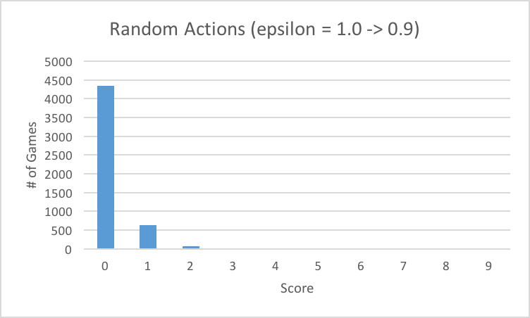

# Reinforcement Learning with TensorFlow #

An attempt at implementing a DQN similar to DeepMind's DQN algorithm from the papers ["Playing Atari with Deep Reinforcement Learning"](https://www.cs.toronto.edu/~vmnih/docs/dqn.pdf) and ["Human-level control through deep reinforcement learning"](https://storage.googleapis.com/deepmind-media/dqn/DQNNaturePaper.pdf) using TensorFlow.

Special thanks to David Silver from DeepMind for [his course](https://youtu.be/2pWv7GOvuf0?list=PLzuuYNsE1EZAXYR4FJ75jcJseBmo4KQ9-) on Reinforcement Learning.

This is continuing work in progress.

`R(s, a)` =  
&nbsp;&nbsp;&nbsp;&nbsp;&nbsp;&nbsp;+1 if the agent has won or achieved some predefined goal as a result of the action `a`.  
&nbsp;&nbsp;&nbsp;&nbsp;&nbsp;&nbsp;&nbsp;&nbsp;&nbsp;&nbsp;&nbsp;&nbsp;in state `s` (e.g. snake game -> snake just   ate some food)  
&nbsp;&nbsp;&nbsp;&nbsp;&nbsp;&nbsp;-1 if agent has lost as a result of the action `a` in state `s`  
&nbsp;&nbsp;&nbsp;&nbsp;&nbsp;&nbsp;&nbsp;&nbsp;&nbsp;&nbsp;&nbsp;&nbsp;(e.g. snake game -> snake went out of bounds or ran into itself)  
&nbsp;&nbsp;&nbsp;&nbsp;&nbsp;&nbsp;&nbsp;&nbsp;-0.01 otherwise 

### Video: After 10 hours of training (on a cpu... ):

#### Score distribution after 10 hours of training:

#### Score distribution after 7 hours of training:

#### Initial Score Distribution (random actions):

More soon.
